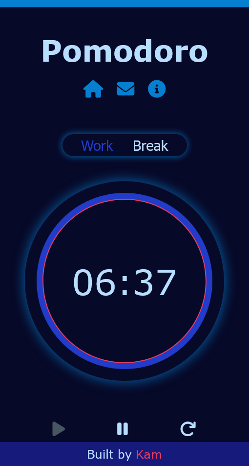

# Pomodoro Timer - personal project solution

This is a pomodor timer completed as a personal project to develop my JavaScript or web development skills.

## Table of contents

- [Overview](#overview)
  - [Screenshot](#screenshot)
  - [Links](#links)
- [My process](#my-process)
  - [Built with](#built-with)
  - [What I learned](#what-i-learned)
  - [Continued development](#continued-development)
  - [Useful resources](#useful-resources)
- [Author](#author)
- [Acknowledgments](#acknowledgments)


## Overview
This is a pomodoro timer designed to enhance productivity by setting a timer for 25 minutes of deep work and 5 minutes short breaks in between.

Users should be able to:

- View the optimal layout for the site depending on their device's screen size
- Switch between modes (the two modes are break and work)
- Press play button to start the timer
- Press pause button to pause the timer
- Press reset button to reset the timer to initial times
- Get an audio alert when timer runs out

### Screenshot

Mobile View:



Large screen:


### Links

- [View Site](https://novatok.github.io/pomodoro/)

## My process

### Built with

- HTML5 markup
- SCSS
- JavaScript
- Flexbox
- Mobile-first workflow


### What I learned

Major takeaway from this project was learning to create a timer  using the set interval method in js.  It took me a while and lots of research to finally understand how to get the timer to countdown. As a beginner I am proud of the final output.
```js
    setCountDown = setInterval(timer, 1000);
```
Looks pretty simple but it is the timer function I had trouble understanding. Here was my solution:
```js 
     function timer() {
        var minutes = Math.floor(seconds/60), 
        remSECS = seconds % 60;

        minsDisplay.innerHTML = minutes;
        secsDisplay.innerHTML = remSECS;

        if(seconds > 0) {
            seconds -= 1;
        }
        else {
            if(work.classList.contains("active")) {
                breakMode();
                playAlarm();
                setTimeout(pauseAlarm,8000);
            }
            else {
                workMode();
                playAlarm();
                setTimeout(pauseAlarm,8000);
            }
        }
    }
```

### Continued development

For further development of this app I plan to update features so users can set there own time limits and add a to-do list option for users to note and checkoff their tasks. Will also include the inspiration API to generate motivational quotes. 

### Useful resources

- [W3schools How to-Countdown timer](https://www.w3schools.com/howto/howto_js_countdown.asp) - This helped me a lot in understanding setinterval method and how to implement the timer.
- [Icons from FontAwesome](https://fontawesome.com/icons) - This is my go to icon collection.

## Author

- Website - [Kamoy](https://novatok.github.io/kamoy_dev/)
- Twitter - [@moyrhoden](https://www.twitter.com/moyrhoden)

## Acknowledgments

This was suggested by @bytesofbree on tiktok and I will be adding all the features she suggested in a future update. 


